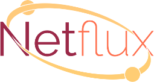

<!-- markdownlint-disable MD033 -->

<!-- markdownlint-disable MD002 -->

<!-- markdownlint-disable MD041 -->

<p align="center">
  <a href="https://coast-team.github.io/netflux">
    
  </a>
</p>

<p align="center">
  Universal Javascript <strong style="font-weight: bold">peer to peer</strong> transport API for client and server.<br />
  Secure and fault tolerant full mesh peer to peer network based on <strong style="font-weight: bold">RTCDataChannel</strong> and <strong style="font-weight: bold">WebSocket</strong>.<br />
  Send/receive <strong style="font-weight: bold">String</strong> and <strong style="font-weight: bold">Uint8Array</strong> data types.<br />
  Documentation: https://coast-team.github.io/netflux
</p>

<p align="center">
  <a href="https://www.npmjs.com/package/netflux">
    
  </a>&nbsp;
  <a href="https://travis-ci.org/coast-team/netflux">
    
  </a>&nbsp;
  <a href="https://coast-team.github.io/netflux">
    
  </a>&nbsp;
  <a href="https://www.bithound.io/github/coast-team/netflux">
    
  </a>&nbsp;

  <br />

  <a href="http://commitizen.github.io/cz-cli">
    
  </a>&nbsp;
  <a href="https://github.com/semantic-release/semantic-release">
    
  </a>&nbsp;
  <a href="https://gitter.im/coast-team/netflux?utm_source=badge&utm_medium=badge&utm_campaign=pr-badge&utm_content=badge">
    
  </a>
</p>

<p align="center">
  
</p>

## Features

* Peer to peer full mesh network which accepts connection failures between some peers.
* If connection between two members failed, other members will retransmit messages for them.
* Automatic rejoin the group if connection lost.
* Automatic selection between [WebSocket][websocket] & [RTCDataChannel][rtcdatachannel].
* Possible to have mixed members: clients (Chrome, Firefox) and servers (NodeJS bot).
* Send private or broadcast [String][string], [Uint8Array][uint8array] data types.
* Possible to send data > 1MB.
* All connections are encrypted.
* Full control over WebRTC servers: Signaling, STUN and TURN.
  * Deploy your own Signaling server ([Sigver][sigver]) or use one provided by default.
  * Configure STUN and TURN servers.
* Small Signaling server payload.
* Signaling server is used only to establish connection between two peers, no user data is passing through it.
* Universal API (works in Chrome/Firefox and NodeJS).
* TypeScript declaration files are included.
* Simple and familiar API usage.
* 4 builds (ES5 code):
  * `dist/netflux.cjs.js` CommonJS format for NodeJS (see _package.json#main_).
  * `dist/esm/index.node.js` ES module format for NodeJS (see _package.json#module_).
  * `dist/esm/index.browser.js` ES module format for browsers (see _package.json#browser_).
  * `dist/netflux.umd.js` UMD format for browsers.

## Usage

Here is a basic usage example for client and server (checkout the [documenation](https://coast-team.github.io/netflux) for more details).

> It is possible to have only clients without any bot server as his is not a mandatory member, but like any other group member.

### Client

```javascript
import { WebGroup, WebGroupState } from 'netflux'

// Create instance and set callbacks
const wg = new WebGroup()
wg.onMemberJoin = (id) => {
  console.log('Member ' + id + ' has joined')
  console.log('All members are: ', wg.members)
}
wg.onMemberLeave = (id) => {
  console.log('Member ' + id + ' has left')
  console.log('All members are: ', wg.members)
}
wg.onMessage = (id, data) => {
  console.log(`Message from ${id} group member`, data)
}
wg.onStateChange = (state) => {
  console.log('The new Group state is ', state)
  switch (state) {
    case WebGroupState.JOINING:
      // Do something
      break
    case WebGroupState.JOINED:
      // Do something
      // For example inviting a bot...
      wg.invite('BOT_SERVER_WEB_SOCKET_URL')
      break
    case WebGroupState.LEAVING:
      // Do something
      break
    case WebGroupState.LEFT:
      // Do something
      break
  }
}

// Join the group
wg.join('MY_UNIQUE_KEY_FOR_THE_GROUP')
```

### Bot Server

```javascript
import { WebGroupBotServer } from 'netflux'
const http = require('http') // https is also possible
const server = http.createServer()

const bot = new WebGroupBotServer({
  server: server,
  webGroupOptions: {
    // Any WebGroup options like for a client
  },
})

bot.onWebGroup = (wg) => {
  // New instance of a WebGroup (Someone has invited this bot).
  // See example above for client as it is the same API.
}

server.listen(BOT_PORT, _BOT_HOST)
// A client may invite this bot with the following URL: 'ws://BOT_HOST:BOT_PORT'
```

## Demo

Netflux is used by our team for Multi User Text Editor ([MUTE repo](https://github.com/coast-team/mute)) development. The demo version is available on: <https://coedit.re>.

[websocket]: https://developer.mozilla.org/en/docs/Web/API/WebSocket
[rtcdatachannel]: https://developer.mozilla.org/en/docs/Web/API/RTCDataChannel
[string]: https://developer.mozilla.org/en/docs/Web/JavaScript/Reference/Global_Objects/String
[uint8array]: https://developer.mozilla.org/docs/Web/JavaScript/Reference/Global_Objects/Uint8Array
[sigver]: https://github.com/coast-team/sigver
[commitizen]: https://img.shields.io/badge/commitizen-friendly-brightgreen.svg?style=flat-square
[commitizen-url]: http://commitizen.github.io/cz-cli
[bithound]: https://www.bithound.io/github/coast-team/netflux/badges/score.svg
[bithound-url]: https://www.bithound.io/github/coast-team/netflux
[codeclimate]: https://codeclimate.com/github/coast-team/netflux/badges/gpa.svg
[codeclimate-url]: https://codeclimate.com/github/coast-team/netflux
[coverage]: https://codeclimate.com/github/coast-team/netflux/badges/coverage.svg
[coverage-url]: https://codeclimate.com/github/coast-team/netflux/coverage
[doc]: https://coast-team.github.io/netflux/badge.svg
[doc-url]: https://coast-team.github.io/netflux/netflux
[logo]: manual/asset/logo_cropped.png 'Netflux logo'
