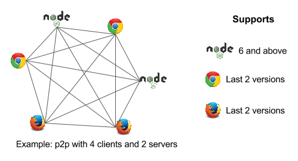

# [](https://nodei.co/npm/netflux/) [](https://gitter.im/coast-team/netflux?utm_source=badge&utm_medium=badge&utm_campaign=pr-badge&utm_content=badge)&nbsp;[](https://github.com/semantic-release/semantic-release)&nbsp;[](http://commitizen.github.io/cz-cli/)&nbsp;

[](https://david-dm.org/coast-team/netflux)&nbsp;
[](https://david-dm.org/coast-team/netflux?type=dev)&nbsp;
[](https://david-dm.org/coast-team/netflux?type=optional)

[](https://travis-ci.org/coast-team/netflux)&nbsp;
[](https://www.bithound.io/github/coast-team/netflux)&nbsp;
[](https://codeclimate.com/github/coast-team/netflux)&nbsp;
[](https://codeclimate.com/github/coast-team/netflux/coverage)&nbsp;
[](https://doc.esdoc.org/github.com/coast-team/netflux)

Abstract peer to peer transport API for client and server.

Permit to create a fully connected peer to peer network based on WebRTC and WebSocket.

Allows to send/receive the following data types over the network: [String](https://developer.mozilla.org/en/docs/Web/JavaScript/Reference/Global_Objects/String), [ArrayBuffer](https://developer.mozilla.org/en/docs/Web/JavaScript/Reference/Global_Objects/ArrayBuffer), [TypedArray](https://developer.mozilla.org/en/docs/Web/JavaScript/Reference/Global_Objects/TypedArray).

<p align="center"></p>

# Table of contents
 - [Installation](https://doc.esdoc.org/github.com/coast-team/netflux/manual/installation.html)
 - [Usage](https://doc.esdoc.org/github.com/coast-team/netflux/manual/usage.html)
 - [Configuration](https://doc.esdoc.org/github.com/coast-team/netflux/manual/configuration.html)
 - [Example](https://doc.esdoc.org/github.com/coast-team/netflux/manual/example.html)

Full documentation: https://doc.esdoc.org/github.com/coast-team/netflux

# API
`create` function is the start point, unless you are developing a peer bot, then consider using `BotServer` (see below). `create` functions return an object of type `WebChannel` which represents the peer to peer network.

`dist/netflux.es2015.js` and `dist/netflux.es2015.umd.js` both exports:

 - [**create**(settings): WebChannel](https://doc.esdoc.org/github.com/coast-team/netflux/function/index.html#static-function-create)

 Members:
  - [**id**: number](https://doc.esdoc.org/github.com/coast-team/netflux/class/src/WebChannel.js~WebChannel.html#instance-member-id)
  - [**members**: number[]](https://doc.esdoc.org/github.com/coast-team/netflux/class/src/WebChannel.js~WebChannel.html#instance-member-members)
  - [**myId**: number**](https://doc.esdoc.org/github.com/coast-team/netflux/class/src/WebChannel.js~WebChannel.html#instance-member-myId)
  - [**onMessage**: function (peerId: number, msg: UserMessage, isBroadcast: boolean)**](https://doc.esdoc.org/github.com/coast-team/netflux/class/src/WebChannel.js~WebChannel.html#instance-member-onMessage)
  - [**onPeerJoin**: function (peerId: number)](https://doc.esdoc.org/github.com/coast-team/netflux/class/src/WebChannel.js~WebChannel.html#instance-member-onPeerJoin)
  - [**onPeerLeave**: function (peerId: number)**](https://doc.esdoc.org/github.com/coast-team/netflux/class/src/WebChannel.js~WebChannel.html#instance-member-onPeerLeave)
  - [**onClose**: function (closeEvt: CloseEvent)**](https://doc.esdoc.org/github.com/coast-team/netflux/class/src/WebChannel.js~WebChannel.html#instance-member-onClose)

  Methods:

  ```
  Open method allows other peers to join your network.
  ```

  - [**open**([options: OpenData]): Promise<OpenData, string>](https://doc.esdoc.org/github.com/coast-team/netflux/class/src/WebChannel.js~WebChannel.html#instance-method-open)
  - [**getOpenData**(): OpenData | null](https://doc.esdoc.org/github.com/coast-team/netflux/class/src/WebChannel.js~WebChannel.html#instance-method-getOpenData)
  - [**isOpen**(): boolean](https://doc.esdoc.org/github.com/coast-team/netflux/class/src/WebChannel.js~WebChannel.html#instance-method-isOpen)
  - [**close**()](https://doc.esdoc.org/github.com/coast-team/netflux/class/src/WebChannel.js~WebChannel.html#instance-method-close)

  ```
  After someone has opened his network and has provided the key to you, you can join his network.
  ```
  - [**join**(keyOrSocket: string | WebSocket[, url: string]): Promise<undefined, string>](https://doc.esdoc.org/github.com/coast-team/netflux/class/src/WebChannel.js~WebChannel.html#instance-method-join)
  - [**leave**()](https://doc.esdoc.org/github.com/coast-team/netflux/class/src/WebChannel.js~WebChannel.html#instance-method-leave)

  ```
  Any member can invite a peer bot (server) to join this network.
  ```
  - [**invite**(urlOrSocket: string | WebSocket): Promise<undefined, string>](https://doc.esdoc.org/github.com/coast-team/netflux/class/src/WebChannel.js~WebChannel.html#instance-method-invite)

  ```
  Any member is allowed to send a message.
  ```
  - [**send**(message: UserMessage)](https://doc.esdoc.org/github.com/coast-team/netflux/class/src/WebChannel.js~WebChannel.html#instance-method-send)
  - [**sendTo**(peerId: number, message: UserMessage)](https://doc.esdoc.org/github.com/coast-team/netflux/class/src/WebChannel.js~WebChannel.html#instance-method-sendTo)

  ```
  Or ping.
  ```
  - [**ping**(): Promise<number, string>](https://doc.esdoc.org/github.com/coast-team/netflux/class/src/WebChannel.js~WebChannel.html#instance-method-ping)
 - [**WEB_RTC**](https://doc.esdoc.org/github.com/coast-team/netflux/variable/index.html#static-variable-WEB_RTC) constant
 - [**WEB_SOCKET**](https://doc.esdoc.org/github.com/coast-team/netflux/variable/index.html#static-variable-WEB_SOCKET) constant

`dist/netflux.es2015.js` additionally exports:

 - [**BotServer**(settings)](https://doc.esdoc.org/github.com/coast-team/netflux/class/src/BotServer.js~BotServer.html)

   Members:

   - [**onWebChannel**: function (wc: WebChannel)](https://doc.esdoc.org/github.com/coast-team/netflux/class/src/BotServer.js~BotServer.html#instance-member-onWebChannel)
   - [**webChannels**: WebChannel[]](https://doc.esdoc.org/github.com/coast-team/netflux/class/src/BotServer.js~BotServer.html#instance-member-webChannels)

   Methods:
   - [**start**(): Promise<undefined, string](https://doc.esdoc.org/github.com/coast-team/netflux/class/src/BotServer.js~BotServer.html#instance-method-start)
   - [**stop**()](https://doc.esdoc.org/github.com/coast-team/netflux/class/src/BotServer.js~BotServer.html#instance-method-stop)
   - [**addWebChannel**(wc: WebChannel)](https://doc.esdoc.org/github.com/coast-team/netflux/class/src/BotServer.js~BotServer.html#instance-method-addWebChannel)
   - [**removeWebChannel**(wc: WebChannel)](https://doc.esdoc.org/github.com/coast-team/netflux/class/src/BotServer.js~BotServer.html#instance-method-removeWebChannel)
   - [**getWebChannel**(id: number): WebChannel | null](https://doc.esdoc.org/github.com/coast-team/netflux/class/src/BotServer.js~BotServer.html#instance-method-getWebChannel)
